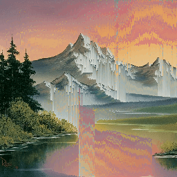

# Pixel Sorter

This program takes a P3 PPM image and performs a glitchy-looking image-processing effect.

The way the algorithm works is the following:
1. Transform the image to grey-scale by using the formula Luminosity = (max(R, G, B) + min(R, G, B)) / 2
2. Turns pixels below a set luminosity threshold to black and above to white
3. Detects vertical groups of white pixels via edge detection and sorts them based on luminosity

The picture used as an example in this github is not my work. It is bob ross's work called "Grey Mountains": [https://www.pbs.org/video/gray-mountain-8oeOcv/](https://www.pbs.org/video/gray-mountain-8oeOcv/)

I got the idea for this algorithm when I saw Acerola's video on the subject on youtube. His implementation is computed with a graphics card, whereas mine is of course computed with a CPU.

These images were generated with a luminosity threshold of 0.5

